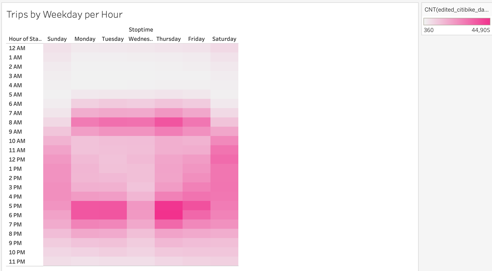
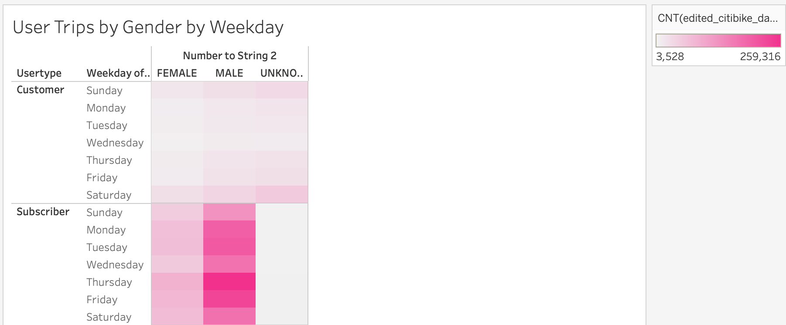
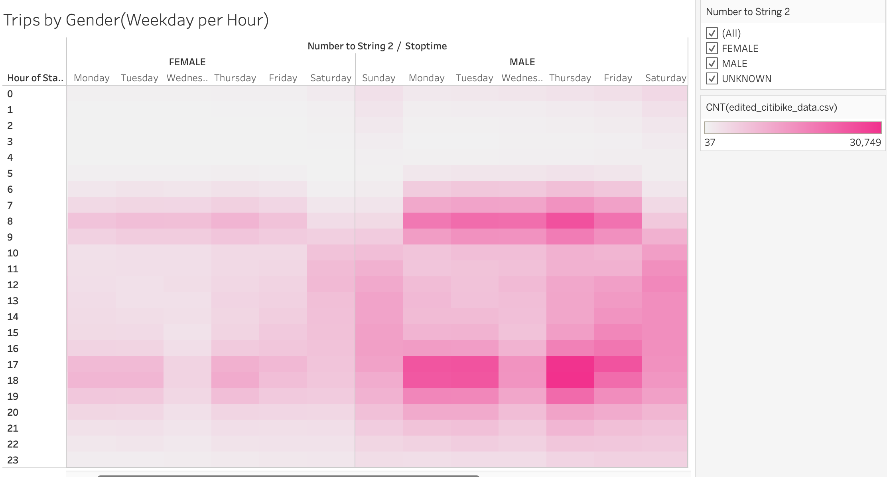

# Bike Sharing Analysis
## Purpose of Project
* The purpose of this analysis was to use data from the Citi Bike Sharing program in New York City, to determine whether or not this program would be a good fit in a different city.
* Below I used Tableu to create visualizations of the data for the stakeholders.
## Results
Link to Tableau Dashboard 
[link to dashboard](https://public.tableau.com/shared/WTMN33G8M?:display_count=n&:origin=viz_share_link)
### Visualizations 
* This visual displays the top starting locations of the rides.  the larger the circle and darker the color, the more of the rides started from that location.

* This analysis below shows the number of times each bike was used.

* Below shows the number total number of people from each gender that used the service.

* These two visuals below show the length of time bikes were checked out by each user.  Then taken a step further and broke it down by gender.  It shows that the majority of trips under 1 hour were taken by Men, which the longer trips lasting more than an hour were taken by women.

* Below are the Trips taken by weekday, by hour. The data shows us primarily that the most trips are taken on weekedays during work commuting times (7am-9am & 5pm-7pm). Then on the weekends during the afternoon.

* Below shows a breakout of subscribers vs non suscribers.  It is found that non subscribers take the most of their rides on the weekends (sat and sunday).  Male subscribers take substatnitally more rides than Female subscribers. Suscribers also take more rides during the week most likely for commuting to work.

* Below shows a breakout of the number of rides taken per hour by Gender.  The data shows that primarily Men take more rides during those commuting hours on weekedays in the mornings.   and late afternoon.  THese were the most popular times for women as well.

## Summary
* In summary this bike program would potentially work well in more urban cities where people are using it to commute to work instead of driving.  It may struggle in more suburban areas where everyone owns a car.
* This program would also work well in locations with a lot of tourism, as it can be used as a way tourists can see more of the city without having to drive everywhere.
