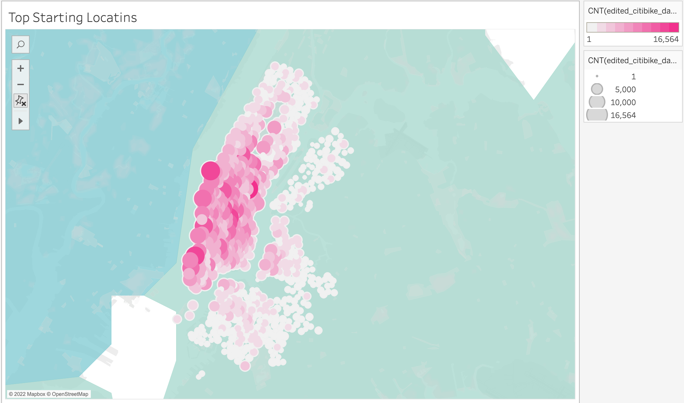
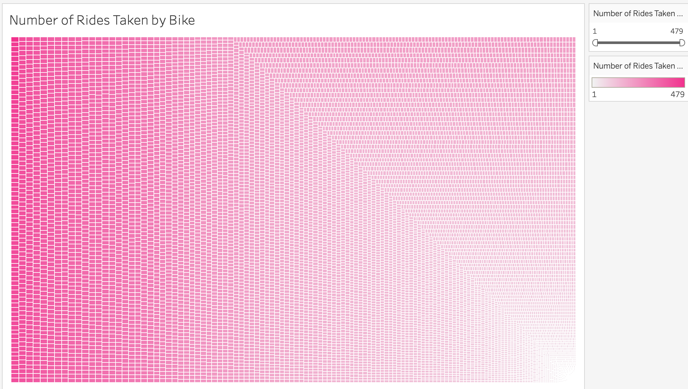

# Bike Sharing Analysis
## Purpose of Project
* The purpose of this analysis was to use data from the Citi Bike Sharing program in New York City, to determine whether or not this program would be a good fit in a different city.
* Below I used Tableu to create visualizations of the data for the stakeholders.
## Results
Link to Tableau Dashboard 
[link to dashboard](https://public.tableau.com/shared/WTMN33G8M?:display_count=n&:origin=viz_share_link)
### Visualizations 
* This visual displays the top starting locations of the rides.  the larger the circle and darker the color, the more of the rides started from that location.

* This analysis below shows the number of times each bike was used.

* Below shows the number total number of people from each gender that used the service.

